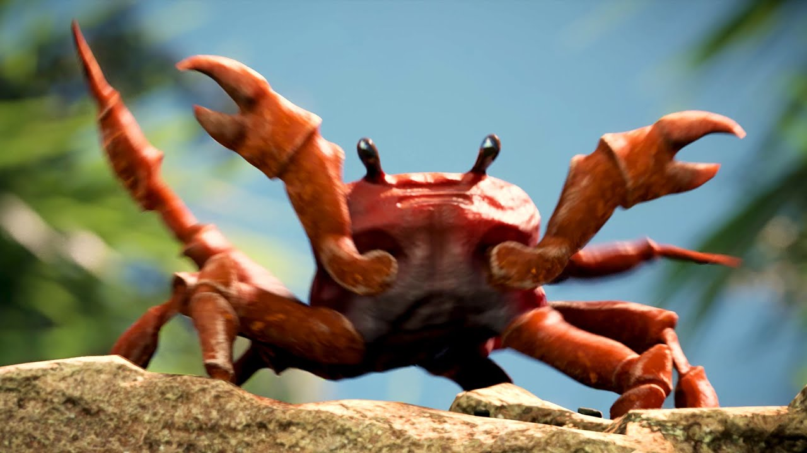

# CrabRaver
A discord bot that only plays "Crab Rave" by NoiseStorm
* If a user was to say "Crab Rave" in any channel while being in voice chat, then the bot will join and proceed to play Crab Rave.

## Setup

### Get the song:
* I got it through the [MonsterCat gold program](https://monster.cat/goldyt), since it's the highest quality of Crab Rave.
* You can try to do Youtube to MP3, but that's against Youtube's TOS. (Just don't do it, since there's a possibility of getting a virus from one of those websites.)

### Installing requirements:
|  Operating system  |  Command  |
| ------------- | ------------- |
|  Windows  |  `py -3 -m pip install -r requirements.txt`  |
|  Linux  | `python3 -m pip install -r requirements.txt`  |

### Setting up configuration:
* Copy `config_example.json` into `config.json`, then replace "Discord token" with your bot token that you get from [Here](https://discordapp.com/developers/applications/) after you create your bot.

### Running the bot:
* After inviting the bot to your server with [this link](https://discordapp.com/oauth2/authorize?client_id=598030607875833856&scope=bot&permissions=37028928), run the following command, depending on your operating system:
|  Operating system  |  Command  |
| ------------- | ------------- |
|  Windows  |  `py -3 bot.py`  |
|  Linux  | `python3 bot.py`  |

### All is done, let the chaos begin.
* The bot should have started up now, enjoy my bot programmed about 90 minutes (bugs included).
